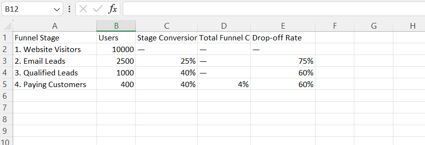

# FUTURE_DS_03: Marketing Funnel & Conversion Performance Analysis

## Project Overview
This project focuses on tracking, modeling, and optimization analysis for a standard 4-stage marketing lead funnel: **Website Visitors → Email Leads → Qualified Leads → Paying Customers**. By calculating step-by-step conversion percentages and identifying drop-off leakages at individual intervals, this report pinpoints where consumer traffic is lost and outlines actionable, data-driven growth strategies to improve customer acquisition efficiency.

---

##  Marketing Funnel Dashboard
Below is the visual conversion funnel and data layout tracking our user journey performance:

---

##  Calculated Marketing Metrics
The performance data below was modeled dynamically in Excel using automated logic formulas to isolate system drop-offs:
* **Stage Conversion Rate Formula:** `=Current Stage Users / Previous Stage Users`
* **Total Funnel Conversion Rate Formula:** `=Current Stage Users / Original Website Visitors`
* **Drop-off Rate Formula:** `=1 - Stage Conversion Rate`

| Funnel Stage | Total Users | Stage Conversion Rate | Total Funnel Conversion | Drop-off Rate |
| :--- | :---: | :---: | :---: | :---: |
| **1. Website Visitors** | 10,000 | — | — | — |
| **2. Email Leads** | 2,500 | **25%** | **25%** | **75%** |
| **3. Qualified Leads** | 1,000 | **40%** | **10%** | **60%** |
| **4. Paying Customers** | 400 | **40%** | **4%** | **60%** |

---

##  Strategic Insights & Recommendations
1. **The Primary Leakage Point (Visitor-to-Lead):** A massive **75%** of landing page traffic bounces without providing contact info. This suggests that while top-of-funnel reach is effective, landing page design, initial hook copy, or lead magnet value require immediate optimization to capture user intent.
2. **High Mid-Funnel Quality:** Once a user converts into an Email Lead, **40%** successfully progress to Qualified Leads, and another **40%** finish as buyers. This exceptional closing rate proves that our acquired leads are highly qualified; the primary bottleneck is purely top-of-funnel registration.
3. **Core Action Plan:** Prioritize conversion rate optimization (CRO) on the primary landing page header. Implementing zero-friction sign-ups and high-incentive lead carrots can easily double customer conversion without increasing top-of-funnel ad spend.

---

##  Repository Contents
*  `task_3_funnel_analysis.xlsx`: Interactive Excel workbook containing structured marketing tracking metrics and formula layers.
*  `funnel_analytics_preview.png`: Visual dashboard image preview showing our marketing pipeline metrics.
